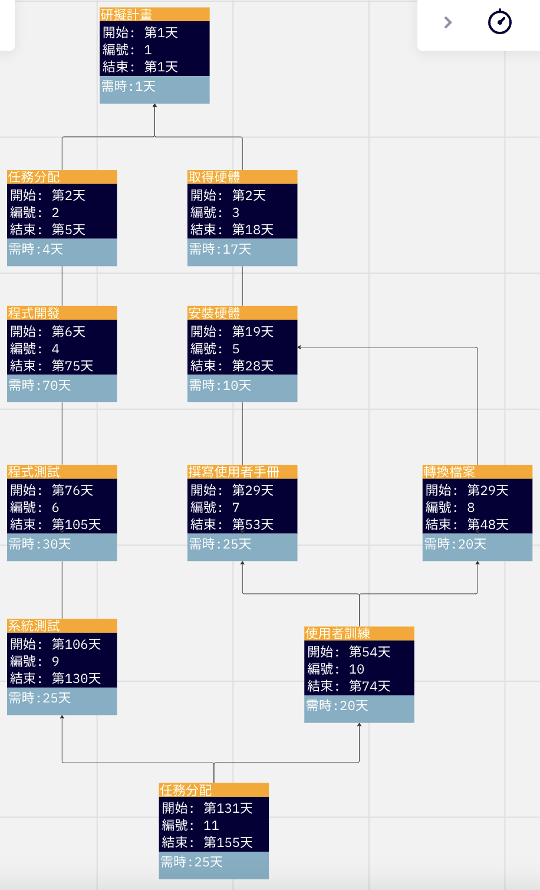
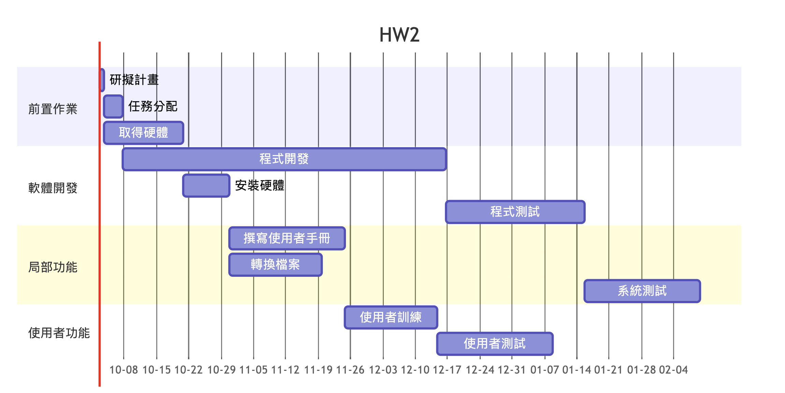
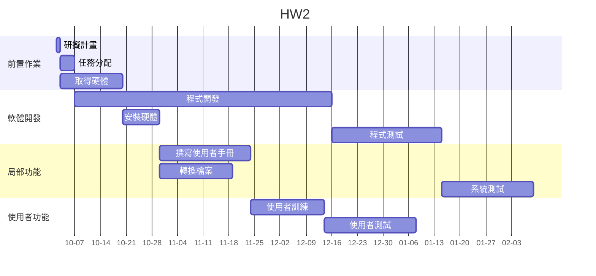
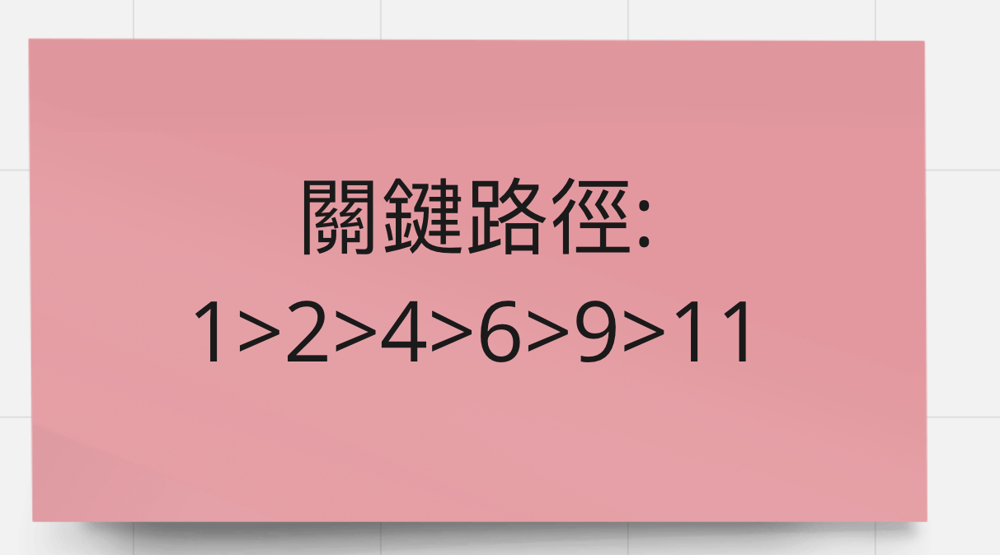

# PERT



### Mermaid
# Gannt 



```mermaid

gantt
    title HW2
	 dateFormat  MM-DD
		%% 日期格式
		axisFormat  %m-%d
		%% 縱軸的日期格式
    section 前置作業
    研擬計畫      :a1,10-2,1d
    任務分配      :a2, after a1  , 4d
	取得硬體      :a3, after a1  , 17d
	
    section 軟體開發
    程式開發      :a4, after a2, 70d
    安裝硬體      :a5, after a3, 10d
	程式測試      :a6, after a4, 30d
	
	section 局部功能
    撰寫使用者手冊 :a7, after a5, 25d
    轉換檔案      :a8, after a5, 20d
	系統測試      :a9, after a6, 25d
	
	section 使用者功能
    使用者訓練    :a10, after a7, 20d
    使用者測試    :a11, after a10, 25d

```

# CPM


```html
 關鍵路徑：1 -> 2 -> 4 -> 8 -> 9 -> 11
```
